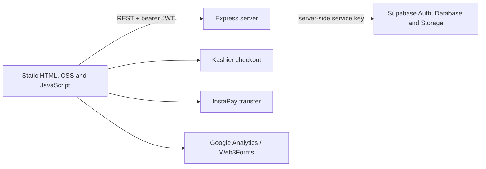

# Dr. Marwa Badr Platform

## Project overview

This is a bilingual, multi-page learning and professional-training website for Dr. Marwa Badr Ahmed. It presents CBT, DBT, ACT, personality-disorder, trauma-recovery, and bundled training courses; allows visitors to create accounts; and supports paid-course enrollment and profile management.

Primary user journeys are:

1. A visitor browses the landing page, course catalogue, testimonials, and blog.
2. A prospective learner opens a course-detail page, signs up or signs in, and enters checkout.
3. A learner submits an InstaPay receipt for manual approval or begins a Kashier checkout.
4. An enrolled learner sees `my-courses.html` and accesses the associated course placeholder page.
5. An authenticated user updates their profile, avatar, password, or deletes their account.

## Architecture



### Frontend

There is no frontend framework or client-side build step. The UI is implemented as static HTML pages, shared `css/style.css`, and vanilla JavaScript in `js/script.js` and `js/payment-service.js`.

- `js/script.js` owns theme switching, responsive navigation, scroll reveals, authentication modal flows, CMS content rendering, blog/testimonial rendering, and cookie-consent behavior.
- `js/payment-service.js` owns browser-side access checks and the InstaPay submission helper.
- Pages retain sessions in `localStorage` and send `Authorization: Bearer <access token>` to the backend.
- The site currently calls its deployed API at `https://drmarwa.onrender.com`; this API base is repeated in several page scripts.

### Backend

`server.js` is an Express application. The installed versions verified locally are Express 4.22.1, `@supabase/supabase-js` 2.104.1, CORS 2.8.6, and dotenv 16.6.1.

The server:

- serves an explicit allow-list of public pages and asset directories;
- uses Supabase Auth to validate bearer tokens;
- uses Supabase database tables for public content, courses, purchases, and sections;
- uses Supabase Storage buckets for avatars and payment receipts; and
- merges database course pricing/media with a server-side course catalogue for descriptions and curricula.

The server currently uses a Supabase server key for administrative profile and account operations. It must remain server-only.

## Project structure

| Location | Purpose |
| --- | --- |
| `server.js` | Express API, auth, course catalogue, Supabase integration, static-file boundary. |
| `index.html` | Landing page, course catalogue, authentication modal, contact/booking sections. |
| `blog.html` | Blog listing page. |
| `course-detail.html` | Dynamic course detail and checkout handoff. |
| `course-*-course.html` | Enrolled-course placeholder pages; client-side access check before display. |
| `checkout.html` | Kashier checkout initiation and InstaPay-receipt submission. |
| `my-courses.html` | Authenticated learner's active enrollments. |
| `profile.html` | Profile, avatar, password, and account deletion actions. |
| `reset-password.html` | Supabase recovery-token password-reset flow. |
| `payment-success.html` | Legacy browser callback page; automatic enrollment is now intentionally unavailable. |
| `privacy-policy.html`, `refund-policy.html`, `terms.html` | Policy pages. |
| `css/style.css` | Shared design tokens, responsive layouts, components, and motion system. |
| `js/script.js` | Shared page behavior and dynamic content rendering. |
| `js/payment-service.js` | Payment/access client helper. |
| `images/`, `fonts/` | Local visual and typography assets. |
| `.env.example` | Safe environment-variable template. |
| `fix-auth-modal.js`, `generate_courses.js`, `inspect-db.js`, `patch-courses.js`, `patch-video.js` | Maintenance/development utilities; they are not public routes. |

`test_fix.html` is a development artifact and is not served publicly by the hardened server.

## Pages and routes

| Page | Purpose and key behavior |
| --- | --- |
| `/` or `index.html` | Marketing homepage, authentication modal, dynamically refreshed sections, courses, posts, and testimonials. |
| `blog.html` | Renders posts from `GET /api/posts`, with a static/error fallback. |
| `course-detail.html?course=<slug>` | Retrieves one course, checks enrollment, and sends a learner to checkout. |
| `checkout.html?course=<slug>` | Requires a local session, checks enrollment, starts Kashier, or submits an InstaPay receipt. |
| `my-courses.html` | Displays active purchases from `GET /api/my-courses`. |
| `course-*-course.html` | Checks access for its matching course before revealing the currently placeholder content. |
| `profile.html` | Authenticated profile changes, avatar upload, password update, and account deletion. |
| `reset-password.html` | Extracts an access token from the Supabase recovery URL fragment and submits a replacement password. |
| `payment-success.html` | Displays the legacy callback UI. It cannot activate access until server-side payment verification exists. |

The server fallback sends the homepage for unknown paths that pass the static boundary. Requests for source, configuration, package, maintenance, or dependency files receive a 404.

## API

All authenticated endpoints require a valid Supabase bearer token unless stated otherwise.

| Endpoint | Method | Behavior |
| --- | --- | --- |
| `/api/auth/signup` | POST | Creates a Supabase email/password account; accepts `email`, `password`, and optional `name`. |
| `/api/auth/login` | POST | Starts an email/password session. |
| `/api/auth/oauth` | GET | Starts Google OAuth. Redirects are limited to `SITE_URL`. |
| `/api/auth/logout` | DELETE | Client invokes this before clearing locally stored session data. |
| `/api/auth/forgot-password` | POST | Sends a reset email without revealing whether the account exists. |
| `/api/auth/resend-verification` | POST | Resends signup confirmation for the verification overlay without revealing account state. |
| `/api/auth/verify-otp` | POST | Verifies a signup OTP using `email` and `token`. |
| `/api/auth/update-password` | POST | Updates the authenticated user's password. |
| `/api/auth/delete-account` | DELETE | Deletes the authenticated user's purchases and Supabase account. |
| `/api/profile/update` | POST | Updates name and/or bio with bounded input lengths. |
| `/api/profile/picture` | POST | Stores a JPEG, PNG, GIF, or WebP avatar up to 5 MB. |
| `/api/posts` | GET | Returns ordered posts, or a built-in fallback list on database failure. |
| `/api/courses` | GET | Returns the merged database/static course catalogue. |
| `/api/courses/:slug` | GET | Returns one merged course. |
| `/api/testimonials` | GET | Returns ordered testimonials, or a built-in fallback list. |
| `/api/sections` | GET | Returns ordered CMS sections, or a built-in fallback. |
| `/api/kashier-hash` | POST | Returns a server-calculated Kashier checkout hash and order ID for a valid course. |
| `/api/instapay-request` | POST | Requires a JPEG, PNG, or WebP receipt up to 5 MB and creates an inactive purchase pending manual approval. |
| `/api/check-access` | GET | Returns `has_access` and pending state for `course_id`. |
| `/api/enrollment-status` | GET | Course-detail alias returning `enrolled` and pending state. |
| `/api/my-courses` | GET | Returns the caller's active purchases enriched with course details. |
| `/api/record-purchase` | POST | **Disabled intentionally.** It previously trusted browser-controlled data and granted paid access. Replace it with a verified payment-provider webhook. |

## Data and integrations

The code verifies the following Supabase resources, though migration files and database constraints are not included in this repository:

- Auth users, with user metadata such as `name`, `bio`, and `avatar_url`.
- `courses` table for pricing, order, duration, images, and excerpts.
- `posts`, `testimonials`, and `sections` tables for CMS-like public content.
- `purchases` table for `user_id`, `course_id`, transaction details, timestamps, amount/currency, and `is_active` enrollment state.
- `avatars` and `receipts` storage buckets.

External integrations present in the code are Supabase, Google OAuth through Supabase, Kashier checkout, InstaPay manual transfer, WhatsApp support links, Google Analytics, and Web3Forms notification submission.

## Important workflows

### Authentication

1. The browser submits credentials to the Express API.
2. The API delegates to Supabase Auth.
3. The browser stores the returned access and refresh tokens locally.
4. Protected page calls send the access token to the API.
5. The API validates that token with `supabase.auth.getUser` before acting.

OAuth and password-reset email destinations are based on `SITE_URL`. Configure this value to the canonical public origin and add it to Supabase's allowed redirect URLs.

### Course access

1. Course detail and checkout identify a course by its catalogue slug.
2. The backend maps the slug to the database ID and reads authoritative price/media data.
3. `purchases.is_active = true` is the access signal used by `check-access`, `enrollment-status`, and `my-courses`.
4. InstaPay requests create inactive purchases for manual review.

### Payment status

Kashier checkout hashing exists, but no verified payment callback/webhook implementation exists in the repository. Browser URL parameters, client-side session markers, and transaction IDs cannot prove that a payment succeeded. Consequently automatic enrollment is disabled until a server-side webhook validates the provider signature, amount, currency, order, and purchaser before atomically activating an enrollment.

## UI, responsiveness, and motion

The visual system is custom CSS with dark/light theme variables, local Year of Handicrafts fonts, reusable primary/outline buttons, glass cards, course cards, modal dialogs, responsive grids, and mobile navigation.

Motion uses transform/opacity-based section reveals driven by `IntersectionObserver`, card/button hover feedback, modal entrances, and restrained decorative floating/pulse effects. `prefers-reduced-motion` disables or shortens transitions and animations. The existing layout includes breakpoints for narrow mobile, tablet, and desktop sizes.

## Security posture

Implemented protections include:

- Static serving is allow-listed; `server.js`, `package.json`, `.env`, `node_modules`, `config`, and maintenance scripts are not publicly reachable.
- `X-Content-Type-Options: nosniff` and a strict referrer policy are set by the server.
- The API validates bearer tokens with Supabase before protected actions.
- Google is the sole OAuth provider accepted by the current client and server route.
- OAuth redirects are constrained to `SITE_URL`.
- Avatar and receipt uploads validate MIME type, base64 shape, and a 5 MB decoded-size limit.
- CMS text is escaped or sanitized before dynamic browser rendering; only a small rich-text tag allow-list is accepted for section/post content.
- The browser-controlled automatic purchase activation endpoint is closed.

## Local development and deployment

Requirements:

- Node.js and npm.
- A Supabase project with the required Auth setup, tables, buckets, and access policies.
- A local `.env` created from `.env.example`.

Commands supported by `package.json`:

```bash
npm install
npm start
npm run watch
```

`npm start` runs `node server.js`; `npm run watch` runs Node's built-in watch mode. No lint, test, type-check, or production build script is configured by this project.

Deploy the backend with all server-only environment variables set in the host. If the static site and API are deployed on different origins, retain the current API-base configuration or centralize it in a future public configuration mechanism. Do not place service-role keys in browser files or public environment variables.

## Verification completed

- Parsed all project JavaScript files and inline page scripts with Node's syntax checker.
- Started the Express server locally and verified the homepage, public JavaScript asset, and course endpoint return HTTP 200.
- Verified source/configuration/dependency paths return HTTP 404 after the static boundary change.
- Verified `POST /api/record-purchase` returns HTTP 503, so a caller cannot self-enroll through that route.
- Verified the new resend-verification endpoint validates a missing email with HTTP 400.

Browser automation could not be run in this environment because the configured `agent-browser` executable is unavailable. No claim is made here about a full interactive browser pass.

## Fixed issues

1. **Critical:** The Express static middleware exposed `server.js` and package files. Public static files are now allow-listed.
2. **Critical:** A client could submit arbitrary transaction IDs to obtain active enrollment. Automatic activation is now closed until verified server-side provider processing exists.
3. **High:** The verification overlay called a nonexistent resend-verification endpoint. The endpoint now exists and is account-enumeration safe.
4. **Medium:** Avatar and receipt upload checks did not consistently validate the data URL/type/decoded file size. Both now have bounded validation; the client/server receipt limit is aligned to 5 MB.
5. **Medium:** CMS-backed values were placed directly into `innerHTML`. Dynamic public content now escapes plain fields and sanitizes constrained rich text.
6. **Medium:** The `watch` script referenced absent `dist-watcher.js`. It now uses `node --watch server.js`.
7. **Low:** Added `.gitignore` and `.env.example` to reduce accidental credential commits.

## Remaining items — REQUIRES_VERIFICATION

- **Payment verification:** Implement and test a signed Kashier webhook before enabling automatic enrollment. Confirm the provider's current signature scheme, callback payload, order mapping, and retry behavior from official provider documentation.
- **Supabase schema and policies:** Database migrations, RLS policies, storage-bucket policies, and administrator approval tooling are absent from this repository. Verify them directly in Supabase.
- **Credential rotation:** A server-role Supabase credential is present in the local environment file. Rotate it in Supabase, update the deployment secret, and ensure no historic repository or deployment logs contain it.
- **Deployment configuration:** Verify the canonical `SITE_URL`, allowed Supabase redirect URLs, deployed API origin, Kashier live credentials, and payment return configuration.
- **Content delivery:** The course pages currently show a “content coming soon” placeholder. Course modules/lessons may exist in Supabase, but this repository does not render them.
- **Browser/regression tests:** Add automated smoke and authentication/payment integration tests. Full browser verification was not available in the local environment.
- **Performance:** Local PNG assets are approximately 0.6–0.9 MB each. Assess WebP/AVIF conversion, responsive image variants, and lazy-loading after visual comparison.
- **Security hardening:** The API currently permits CORS broadly to support its separate static-site origin. Restrict allowed origins only after confirming every production/staging origin.
